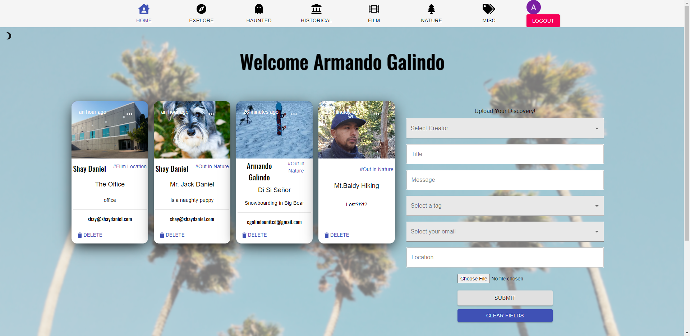
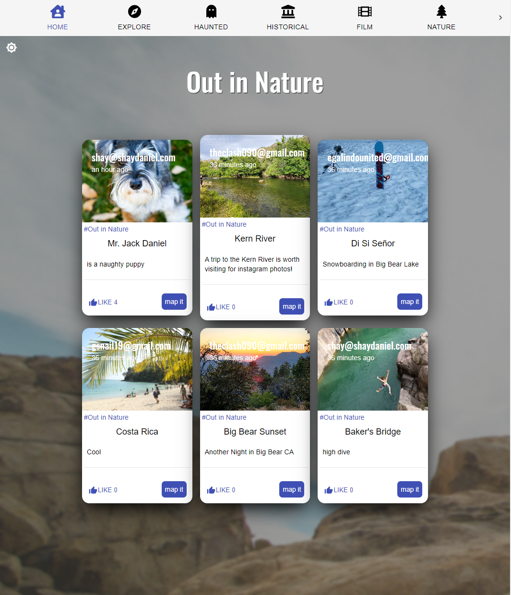
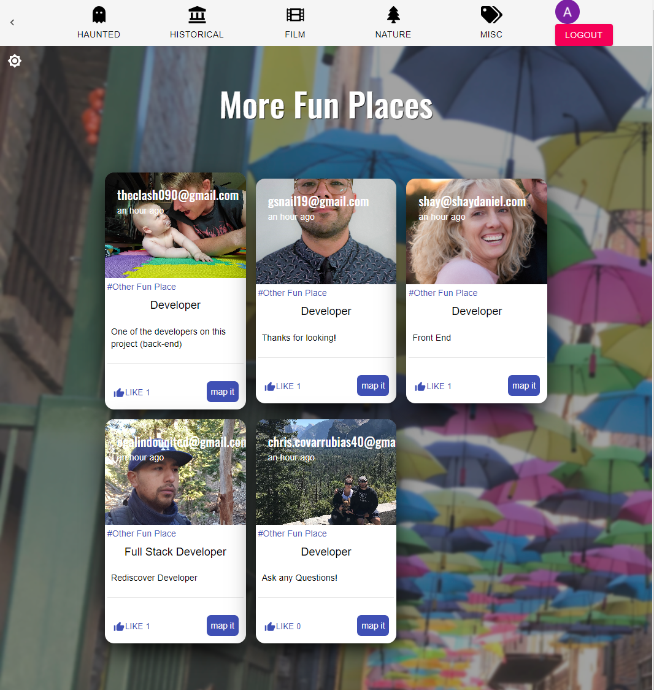

# REDISCOVER  

# Description
## Welcome to a community of urban explorers, discovering the rich and historical world around us - right in our own backyards.

*Rediscover is a React application that allows a user to discover and share interesting and cool places near them.*

 

## View:

Visit Rediscover [here](https://rediscoverapp.netlify.app/ "Link to Rediscover").
       
 

## Technologies used:  
 

| Server side |           |  
| ------------| --------- |
| body-parser | mongoose  | 
| cors        | nodemon   | 
| express     | react-dom | 

 

| Client side             |                   |                  |
| -------------           | -------------     | --------------   |
| axios                   | react             | react-spring     |
| bootstrap               | react-bootstrap   | redux            |
| Google API              | react-dom         | redux-thunk      |
| Google Login            | react-file-base64 | styled-components|
| Google O-Authorization  | react-redux       | testing-library  |
| Material UI             | react-router-dom  | UnSplash         |
| moment                  | react-scripts     | web-vitals       |
 
 

## Screenshots 

 

## License

 

## Contributors 
 
* Shay Daniel - [Github](https://github.com/shaydaniel7/), [Email](mailto:"shay@shaydaniel.com")
* Giovanny Franco - [Github](https://github.com/gfranco19), [Email](mailto:"gsnail19@gmail.com")
* Todd Wayment - [Github](https://github.com/Tbonexas), [Email](mailto:"theclash090@gmail.com")
* Armando Galindo - [Github](https://www.github.com/CdmMandaloria), [Email](mailto:"egalindounited@gmail.com")
* Chris Covarrubias - [Github](https://github.com/covo40), [Email](mailto:"egalindounited@gmail.com")

